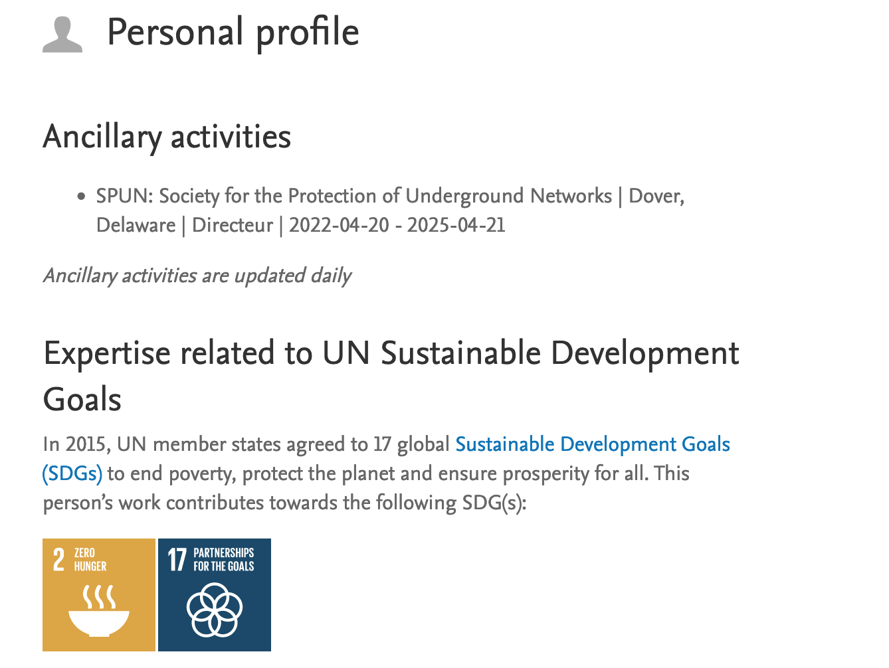
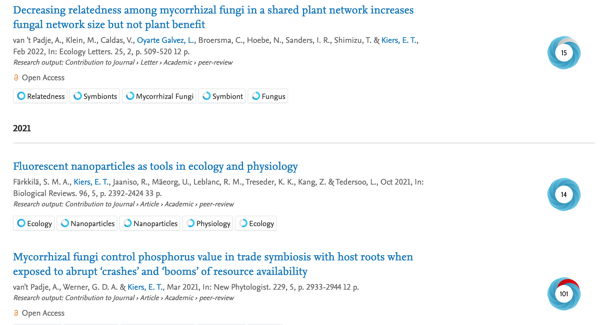
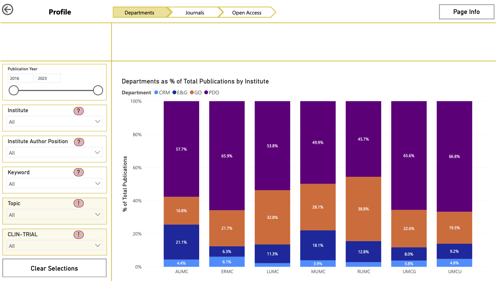
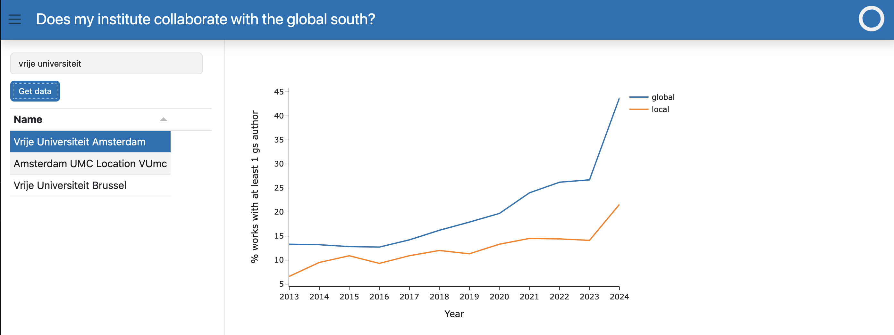
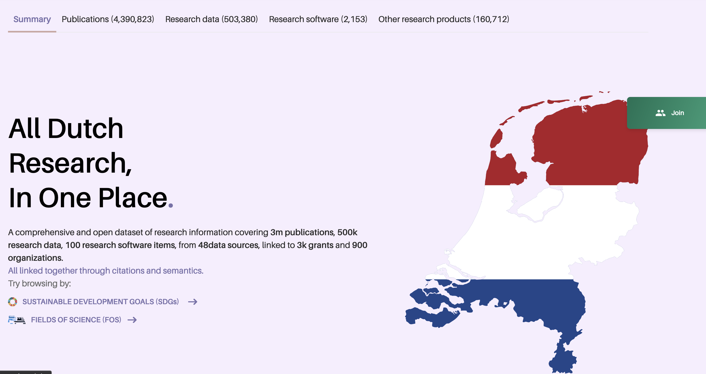
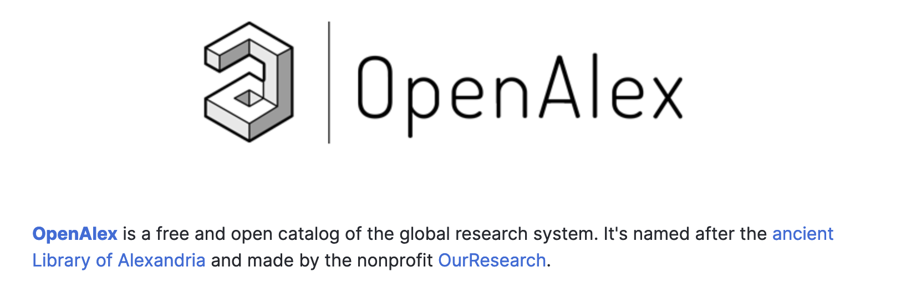

## Research Impact: The Library's role

::: { .callout-note }
## Information Provision
- Pure for registration
- Access to metadata and derived indicators
- Advice on responsible indicators
:::

:::: { .fragment fragment-index=4 .fade-out }

::: { .fragment fragment-index=2 .absolute top="85%" left="5%" }
Research Portal: <https://research.vu.nl/>
:::

{.fragment .shadow fragment-index=2 .absolute top="5%" left="10%" width="50%"}
{.fragment fragment-index=3 .shadow .absolute top="20%" left="20%" width="75%"}
::::

:::: {.fragment fragment-index=4}
::: {.callout-note}
## More active support
- Analysis and interpretation
- Focus on strategic decisions
<!-- - 🎉 Team Research Intelligence 🎉 -->
:::
::::

## What kind of support?

::: {.callout-note}
## We support by &#8230;
- Collecting data
  - &#8618;*for department, faculty*
- Linking with metadata and indicators
  - &#8618;*citations, media attention, policy impact, SDGs*
- Providing insights to improve decision-making
  - &#8618;*visualizations, interactive dashboards*
:::

::::: {.callout-note icon=false}
## How is this used?

:::: {.columns}

::: {.column width="40%"}
- *Strategy Evaluation Protocol*
- Self-evaluations
:::
::: {.column width="50%"}
- Opportunities for collaboration
- Exploration for appointments
:::

::: {.column width="10%"}

- &#8230;
:::
::::
:::::

::: {.notes}
Goal of the slide: 
Pitch what RI does 
:::

## {#dashboard data-menu-title="Dashboard example"}

{.lightbox}

## Developments

::: {.callout-note}
## New indicators

- For more flexible SEP
- For Recognition and Rewards
- For Open science
- For evaluation and monitoring
:::

::: {.callout-note}
## New data sources
- Open Research *Information*
  - &#8618; Open Research *Assessment*
:::

## New indicators

::: {.callout-note}
## R&R: New expectations, new evaluations
- More than 'counting publications'
- More emphasis on other forms of output and impact
- New indicators needed
:::

## Open RI Tools: Collaboration with the global south

## Open research information

::: {.callout-note}
## Context
- UB important role in OS movement
- Availability of open data
- National and international initiatives
:::

::: {.fragment fragment-index=1 .absolute top="5%" left="10%" width="75%" height="auto"} 

:::

::: {.fragment fragment-index=2 .shadow .absolute top="40%" left="35%" width="75%"}

:::

## Takeaways

::: {.callout-note }
## Research Intelligence
- 📊 Research Intelligence supports research units in making informed decisions
- 🔍 We provide data, insights, and tools to analyse research impact
- 🤝 Flexible and collaborative, designed for specific needs
:::

::: {.callout-note }
## Innovation and collaboration
- 🚀 Many new developments for research assessment
- 💡 We are open to new ideas and collaboration
:::
